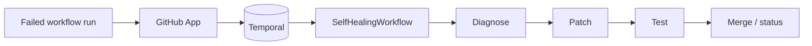

<div align="center">

<pre>
#################################################################################################
#                                                                                               #
#              ____       _  __   _   _            _ _                ____ ___                  #
#             / ___|  ___| |/ _| | | | | ___  __ _| (_)_ __   __ _   / ___|_ _|                 #
#             \___ \ / _ \ | |_  | |_| |/ _ \/ _` | | | '_ \ / _` | | |    | |                  #
#              ___) |  __/ |  _| |  _  |  __/ (_| | | | | | | (_| | | |___ | |                  #
#             |____/ \___|_|_|   |_| |_|\___|\__,_|_|_|_| |_|\__, |  \____|___|                 #
#                                                             |___/                             #
#                                                                                               #
#################################################################################################
</pre>

**React to broken CI with context, diagnosis, and an automated fix path** — a GitHub App plus Temporal worker that collects failure data, asks Claude for a root cause and patch, applies changes via GitHub or Morph, runs tests and optional proof checks, then updates status or merges when your policy allows.

</div>

---

## At a glance

|                   |                                                                                   |
| :---------------- | :-------------------------------------------------------------------------------- |
| **Trigger**       | Failed GitHub Actions workflow runs (with allowlists, deduplication, and budgets) |
| **Orchestration** | [Temporal](https://temporal.io/) — durable workflows and retries                  |
| **AI**            | Anthropic Claude for structured diagnosis                                         |
| **Patching**      | Unified diffs on a branch / PR, or Morph HTTP when configured                     |
| **Verification**  | Tests (HTTP, Docker Freestyle, or local shell) · optional Lean proofs             |
| **State**         | Redis for dedup and workflow state when `REDIS_URL` is set                        |

---

## How it flows



From here you can go deeper: [full architecture](docs/architecture/system.md), [docs index](docs/README.md), [security overview](docs/security/README.md).

---

## Prerequisites

| Requirement  | Notes                                                                                                                        |
| ------------ | ---------------------------------------------------------------------------------------------------------------------------- |
| **Node.js**  | 20+                                                                                                                          |
| **pnpm**     | 8+ (see [`package.json`](package.json) `packageManager`)                                                                     |
| **Temporal** | Server reachable from the worker ([CLI dev server](https://docs.temporal.io/cli#start-a-local-development-server) or hosted) |
| **Redis**    | Recommended; optional with degraded dedup/state                                                                              |
| **Docker**   | Optional — for `SELF_HEALING_TEST_EXECUTION_MODE=docker` and Freestyle bind mounts                                           |

### Redis in one command

```bash
docker compose up -d redis
```

Listens on `127.0.0.1:6379` by default — matches `REDIS_URL` in [.env.example](.env.example). Temporal is **not** included in Compose; run it separately.

---

## Quick start

**1. Install and configure**

```bash
pnpm install
cp .env.example .env
# Edit .env — see tables below
```

**2. Build and validate**

```bash
pnpm build
pnpm validate
```

**3. Run the app** (with Temporal and Redis already up)

```bash
pnpm --filter @self-healing-ci/github-app dev
pnpm --filter @self-healing-ci/temporal-worker dev
```

---

## Configuration

Copy [.env.example](.env.example) to `.env` and fill values. Grouped for scanning:

### GitHub, AI, Temporal

| Variable                                                           | Role                                                 |
| ------------------------------------------------------------------ | ---------------------------------------------------- |
| `GITHUB_APP_ID`, `GITHUB_PRIVATE_KEY`, `GITHUB_WEBHOOK_SECRET`     | GitHub App authentication and webhooks               |
| `ANTHROPIC_API_KEY`                                                | Claude (skip real calls with `SELF_HEALING_DRY_RUN`) |
| `TEMPORAL_SERVER_URL`, `TEMPORAL_NAMESPACE`, `TEMPORAL_TASK_QUEUE` | Worker and client                                    |
| `REDIS_URL`                                                        | Dedup and workflow state                             |

### Self-healing and patching

| Variable                                                                  | Role                                                                                             |
| ------------------------------------------------------------------------- | ------------------------------------------------------------------------------------------------ |
| `SELF_HEALING_ENABLED`, `SELF_HEALING_DRY_RUN`, `SELF_HEALING_AUTO_MERGE` | Feature gates                                                                                    |
| `SELF_HEALING_WORKFLOW_ALLOWLIST`                                         | Comma-separated substrings matched against workflow name (default tokens: ci, test, build, lint) |
| `PATCH_BACKEND`                                                           | `github` (default) or `morph`                                                                    |
| `MORPH_API_URL`, `MORPH_API_KEY`                                          | Morph HTTP when `PATCH_BACKEND=morph`                                                            |

### Tests and proofs

| Variable                                                                                 | Role                                               |
| ---------------------------------------------------------------------------------------- | -------------------------------------------------- |
| `SELF_HEALING_TEST_EXECUTION_MODE`                                                       | `http` · `docker` · `local` · `auto` · `disabled`  |
| `SELF_HEALING_TEST_COMMAND`, `SELF_HEALING_TEST_TIMEOUT_MS`, `SELF_HEALING_TEST_WORKDIR` | Command, timeout, checkout path                    |
| `FREESTYLE_USE_DOCKER`, `FREESTYLE_HOST_WORKSPACE`, `FREESTYLE_DOCKER_*`                 | Docker test backend (`@self-healing-ci/freestyle`) |
| `FREESTYLE_API_URL`, `FREESTYLE_API_KEY`                                                 | Remote Freestyle API (`POST /v1/test-runs`)        |
| `LEAN_PROOFS_EXECUTION_MODE`, `LEAN_LOCAL_WORKSPACE`, `LEAN_LOCAL_TIMEOUT_MS`            | Lean: HTTP, local package, or `auto`               |
| `LEAN_API_URL`, `LEAN_API_KEY`                                                           | Remote Lean API (`POST /v1/proofs/validate`)       |

### Observability

| Variable                                             | Role                                               |
| ---------------------------------------------------- | -------------------------------------------------- |
| `CLOUDEVENTS_INGEST_URL`, `CLOUDEVENTS_INGEST_TOKEN` | Optional CloudEvents HTTP ingest                   |
| `METRICS_PORT`, `JAEGER_ENDPOINT`, `LOG_LEVEL`       | Metrics server and tracing hooks (see worker docs) |

---

## Repository layout

```
apps/
  github-app/           Webhooks, Probot, Temporal workflow starts
  temporal-worker/      Workflows, activities, metrics HTTP server
services/
  claude/               Claude client and failure types
  morph/                Patch validation and Morph-oriented helpers
  freestyle/            Docker / HTTP test execution
  lean/                 Proof validation (local or HTTP)
  static-analysis/      Lint / analysis helpers
  fuzzing/              Fuzzing scaffolding
  attestation/          Attestation-oriented code
docs/                   Architecture and security write-ups
scripts/                e.g. security-audit.js
docker-compose.yml      Local Redis (default)
```

---

## Scripts

| Command               | What it does                                                                                                     |
| --------------------- | ---------------------------------------------------------------------------------------------------------------- |
| `pnpm build`          | Build all workspaces                                                                                             |
| `pnpm test`           | Tests in every package                                                                                           |
| `pnpm test:coverage`  | Tests with coverage                                                                                              |
| `pnpm lint`           | ESLint across packages                                                                                           |
| `pnpm type-check`     | `tsc --noEmit` everywhere                                                                                        |
| `pnpm format`         | Prettier check                                                                                                   |
| `pnpm validate`       | lint + type-check + test                                                                                         |
| `pnpm ci`             | Same pipeline as [CI](.github/workflows/ci.yml): install, build claude + freestyle + lean, typecheck, lint, test |
| `pnpm security:audit` | Repository security audit script                                                                                 |
| `pnpm security:check` | Audit script plus `pnpm audit`                                                                                   |

---

## Contributing

Branch from `main`, run `pnpm validate` before opening a PR. Commits follow [Conventional Commits](https://www.conventionalcommits.org/) (enforced via Commitlint — `commitlint.config.js`).

---

## License

[MIT](LICENSE)

---

## Security

Report vulnerabilities using [SECURITY.md](SECURITY.md).
