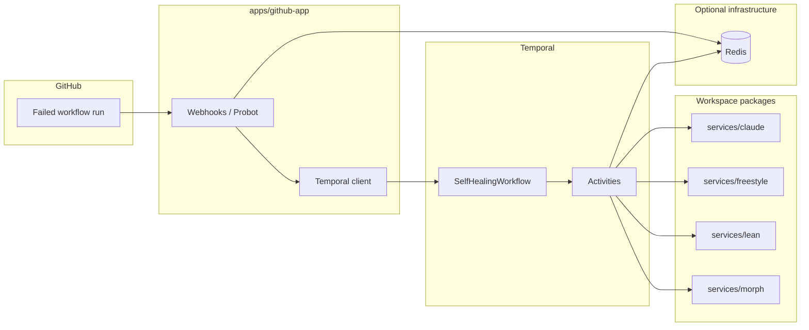
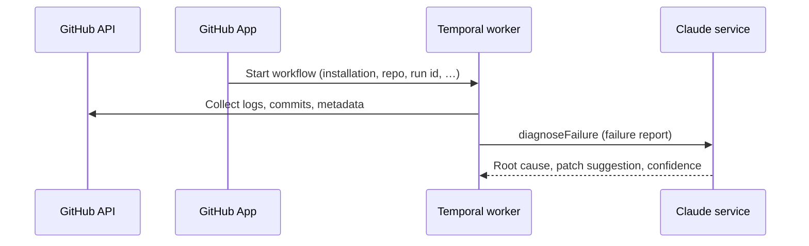

# System architecture

This document describes how Self-Healing CI is structured in this repository, how data flows through it, and which parts are **implemented** versus **roadmap** or optional deployment.

## High-level view

The GitHub App reacts to failed workflow runs (subject to feature flags and allowlists), starts a Temporal workflow, and the worker runs activities that call GitHub APIs, Claude (`@self-healing-ci/claude`), optional Morph patching, test execution, proof validation, merge, and CloudEvents.

## Components

### GitHub App (`apps/github-app`)

- Receives GitHub webhooks (workflow runs and related events).
- Validates payloads and signatures using app secrets.
- Applies **self-healing** gating: global enable flag, workflow name allowlist (`SELF_HEALING_WORKFLOW_ALLOWLIST`), deduplication, and daily budgets before starting `SelfHealingWorkflow` on Temporal.

### Temporal worker (`apps/temporal-worker`)

- Hosts **workflows** (for example `SelfHealingWorkflow`) and **activities**: collect failure context, diagnose with Claude, apply patches (GitHub branch/PR or Morph HTTP when configured), run tests, validate proofs, merge, update status, emit CloudEvents.
- Persists auxiliary state in **Redis** when `REDIS_URL` is set (deduplication and workflow state helpers).
- Can expose a small **metrics HTTP server** (see `METRICS_PORT`): `/health`, `/ready`, `/metrics`, and alert-related routes (see `src/metrics-server.ts`).

### Workspace services (libraries)

| Package                      | Role                                                                                                                                                                |
| ---------------------------- | ------------------------------------------------------------------------------------------------------------------------------------------------------------------- |
| `@self-healing-ci/claude`    | Claude client, failure report building, diagnosis payloads                                                                                                          |
| `@self-healing-ci/morph`     | Patch application with local validation helpers (used as a library; worker may also call a remote Morph HTTP API for `PATCH_BACKEND=morph`)                         |
| `@self-healing-ci/freestyle` | Docker-based deterministic test runs (used when worker test mode is `docker` or when integrated via env; optional HTTP adapter documented for `POST /v1/test-runs`) |
| `@self-healing-ci/lean`      | Lean proof validation workspace logic (used when `LEAN_PROOFS_EXECUTION_MODE=local` or via HTTP when API URL and key are set)                                       |

These packages are **not** separate network microservices in the default layout: they are imported by the worker (and/or invoked via HTTP where documented).

## Data flows

### 1. Failure to diagnosis

### 2. Patch application

- **Default (`PATCH_BACKEND=github` or unset):** activities apply a unified diff on a branch and open/update a PR via the GitHub API (`github-healing-patch` and related code).
- **Morph (`PATCH_BACKEND=morph` with `MORPH_API_KEY`):** worker posts to the configured Morph HTTP endpoint; the `@self-healing-ci/morph` package is available for richer local validation flows when you wire it that way.

### 3. Tests (`run-tests` activity)

Execution mode is controlled by `SELF_HEALING_TEST_EXECUTION_MODE` and related variables:

| Mode       | Behavior                                                                                                                          |
| ---------- | --------------------------------------------------------------------------------------------------------------------------------- |
| `http`     | `POST` to `{FREESTYLE_API_URL}/v1/test-runs` with bearer auth                                                                     |
| `docker`   | `@self-healing-ci/freestyle` with Docker bind-mount (`FREESTYLE_HOST_WORKSPACE` or `SELF_HEALING_TEST_WORKDIR`)                   |
| `local`    | Shell command in `SELF_HEALING_TEST_WORKDIR`                                                                                      |
| `auto`     | Prefer HTTP if API URL and key are set; else optional Docker when `FREESTYLE_USE_DOCKER=true`; else local shell if workdir is set |
| `disabled` | Skips meaningful execution (returns a clear error)                                                                                |

### 4. Proofs (`validate-proofs` activity)

`LEAN_PROOFS_EXECUTION_MODE` selects **HTTP** (`LEAN_API_URL` + `LEAN_API_KEY`), **local** (`@self-healing-ci/lean` on the worker host), or **auto** (HTTP when configured, otherwise local).

### 5. Observability

- **Structured logging** via Winston in apps and services.
- **Prometheus** metrics from the worker metrics server when enabled (`METRICS_PORT`).
- **CloudEvents:** activities can POST CloudEvents 1.0 JSON to `CLOUDEVENTS_INGEST_URL` (optional bearer `CLOUDEVENTS_INGEST_TOKEN`).
- **Jaeger / OpenTelemetry:** optional endpoints and instrumentation exist in dependencies; full production wiring is deployment-specific.

## Local development dependencies

- **Redis:** `docker compose up -d redis` (see root `docker-compose.yml`) exposes `6379` by default.
- **Temporal:** not included in compose; use the [Temporal CLI dev server](https://docs.temporal.io/cli) or a hosted namespace.

## Security (summary)

- Webhook HMAC verification, input sanitization helpers, and environment-based configuration are implemented in the GitHub App and shared utilities (see `docs/security/README.md` and `SECURITY.md`).
- Advanced items such as full **OIDC** for every integration, **service mesh mTLS**, **OPA** everywhere, and **SLSA** attestation pipelines are **not** described as fully deployed in this repo; treat them as hardening goals unless your fork adds them.

## Roadmap and optional stacks

The following appear in older diagrams or long-term plans but are **not** required for the core loop in this repository:

- Kubernetes deployment manifests as the default
- PostgreSQL as primary application store (Redis is used for specific worker/github-app state)
- Full Prometheus/Grafana/Jaeger stacks (metrics endpoint exists; dashboards are yours to deploy)
- Cosign/SLSA supply-chain automation beyond what individual `services/*` stubs may sketch

Refer to root `README.md` and `.env.example` for what you must configure to run the system end to end.
